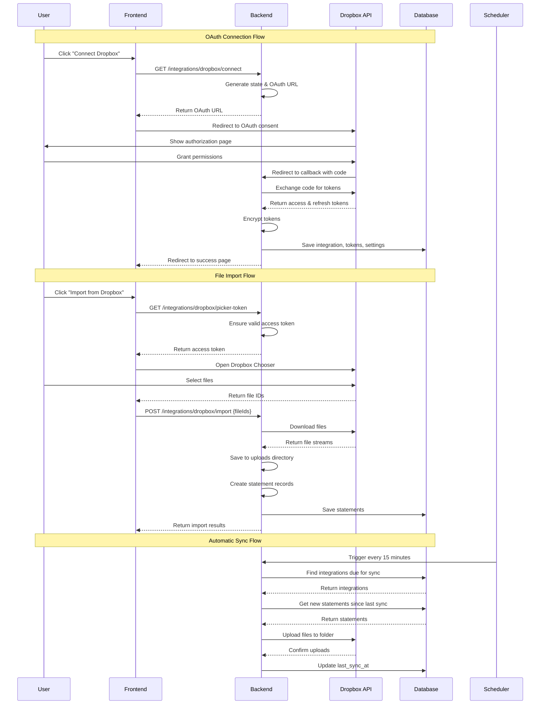

I have created the following plan after thorough exploration and analysis of the codebase. Follow the below plan verbatim. Trust the files and references. Do not re-verify what's written in the plan. Explore only when absolutely necessary. First implement all the proposed file changes and then I'll review all the changes together at the end.

## Observations

The codebase has a well-structured Google Drive integration with clear separation of concerns: backend module (`file:backend/src/modules/google-drive/`) with service, controller, scheduler, and DTOs; database entities (`file:backend/src/entities/`) for integrations, tokens, and settings; frontend components (`file:frontend/app/components/GoogleDriveStorageWidget.tsx`, `file:frontend/app/integrations/google-drive/page.tsx`) with picker integration; and scheduled sync jobs. The architecture uses OAuth 2.0 flow, encrypted token storage, TypeORM entities, NestJS modules, and Google APIs SDK (`googleapis` package). The integration supports file import via Google Picker, automatic daily sync to Drive, and configurable settings (folder, sync time, timezone).

## Approach

The Dropbox integration will mirror the Google Drive architecture exactly, creating parallel structures for all components. This approach ensures consistency, maintainability, and leverages existing patterns. The implementation will use the official Dropbox JavaScript SDK (`dropbox` package) for backend operations and Dropbox Chooser API for frontend file selection. All entities will be extended to support the new `DROPBOX` provider, reusing existing `integrations`, `integration_tokens` tables, and creating a new `dropbox_settings` entity similar to `drive_settings`. The OAuth flow, token management, file operations, and sync scheduler will follow identical patterns to Google Drive.

## Implementation Plan

### 1. Backend Database Schema

**Extend Integration Entities**

Update `file:backend/src/entities/integration.entity.ts`:
- Add `DROPBOX = "dropbox"` to `IntegrationProvider` enum

**Create Dropbox Settings Entity**

Create `file:backend/src/entities/dropbox-settings.entity.ts`:
- Mirror structure of `DriveSettings` entity
- Fields: `id`, `integrationId`, `folderId`, `folderName`, `syncEnabled`, `syncTime`, `timeZone`, `lastSyncAt`, `createdAt`, `updatedAt`
- OneToOne relationship with `Integration` entity
- Use same column names and types as `drive_settings` table

**Create Migration**

Create `file:backend/src/migrations/[timestamp]-AddDropboxIntegration.ts`:
- Create `dropbox_settings` table with identical structure to `drive_settings`
- No changes needed to `integrations` or `integration_tokens` tables (already generic)
- Add index on `integration_id` in `dropbox_settings`

### 2. Backend Module Structure

**Create Dropbox Module Directory**

Create `file:backend/src/modules/dropbox/` with the following files:

**DTOs**

Create `file:backend/src/modules/dropbox/dto/import-dropbox-files.dto.ts`:
- Mirror `ImportDriveFilesDto` structure
- Validate array of file IDs

Create `file:backend/src/modules/dropbox/dto/update-dropbox-settings.dto.ts`:
- Mirror `UpdateDriveSettingsDto` structure
- Fields: `folderId`, `folderName`, `syncEnabled`, `syncTime`, `timeZone`
- Same validation rules (HH:MM format for syncTime)

**Service Layer**

Create `file:backend/src/modules/dropbox/dropbox.service.ts`:
- Install `dropbox` npm package and `isomorphic-fetch`
- Import Dropbox SDK: `import { Dropbox } from 'dropbox'`
- Mirror all methods from `GoogleDriveService`:
  - `getAuthUrl(user)`: Generate OAuth URL using Dropbox SDK's `getAuthenticationUrl` method
  - `handleOAuthCallback(params)`: Exchange code for tokens using `getToken` method
  - `getStatus(userId)`: Return connection status and settings
  - `disconnect(userId)`: Remove tokens and update status
  - `updateSettings(userId, dto)`: Update dropbox_settings
  - `getPickerToken(userId)`: Return access token for Dropbox Chooser
  - `importFiles(userId, dto)`: Download files from Dropbox using `filesDownload`, save to uploads directory, create statements
  - `syncNow(userId)`: Manually trigger sync
  - `syncDueIntegrations()`: Find integrations due for sync and process them
  - `syncIntegration(integration)`: Upload new statements to Dropbox using `filesUpload`
- Use same encryption utilities (`encryptText`, `decryptText`) for token storage
- Use same state signing mechanism for OAuth security
- Implement token refresh logic using Dropbox SDK
- Use `ALLOWED_MIME_TYPES` constant: `application/pdf`, `text/csv`, `application/vnd.openxmlformats-officedocument.wordprocessingml.document`
- Default sync time: `03:00`
- Inject repositories: `Integration`, `IntegrationToken`, `DropboxSettings`, `Statement`, `User`
- Inject services: `StatementsService`, `FileStorageService`

**Controller Layer**

Create `file:backend/src/modules/dropbox/dropbox.controller.ts`:
- Mirror `GoogleDriveController` structure
- Route prefix: `@Controller('integrations/dropbox')`
- Endpoints:
  - `GET /integrations/dropbox/status`: Get connection status
  - `GET /integrations/dropbox/connect`: Get OAuth URL
  - `GET /integrations/dropbox/callback`: Handle OAuth callback (public route)
  - `POST /integrations/dropbox/disconnect`: Disconnect integration
  - `POST /integrations/dropbox/settings`: Update settings
  - `GET /integrations/dropbox/picker-token`: Get access token for Chooser
  - `POST /integrations/dropbox/import`: Import files from Dropbox
  - `POST /integrations/dropbox/sync`: Manual sync trigger
- Use `JwtAuthGuard` for all routes except callback
- Use `@CurrentUser()` decorator to get authenticated user

**Scheduler**

Create `file:backend/src/modules/dropbox/dropbox.scheduler.ts`:
- Mirror `GoogleDriveScheduler` structure
- Use `@Cron("*/15 * * * *")` decorator (every 15 minutes)
- Call `dropboxService.syncDueIntegrations()`

**Module Definition**

Create `file:backend/src/modules/dropbox/dropbox.module.ts`:
- Import `TypeOrmModule.forFeature([Integration, IntegrationToken, DropboxSettings, Statement, User, WorkspaceMember])`
- Import `StatementsModule`
- Provide: `DropboxService`, `DropboxScheduler`, `FileStorageService`
- Export: `DropboxController`

**Register Module**

Update `file:backend/src/app.module.ts`:
- Import `DropboxModule`
- Add to `imports` array

### 3. Backend Environment Configuration

Update `file:backend/.env.example`:
```
# Dropbox OAuth
DROPBOX_CLIENT_ID=your-dropbox-app-key
DROPBOX_CLIENT_SECRET=your-dropbox-app-secret
DROPBOX_REDIRECT_URI=http://localhost:3001/api/v1/integrations/dropbox/callback
DROPBOX_STATE_SECRET=change-this-state-secret
```

### 4. Frontend File Picker Integration

**Create Dropbox Chooser Utility**

Create `file:frontend/app/lib/dropboxChooser.ts`:
- Load Dropbox Chooser script: `https://www.dropbox.com/static/api/2/dropins.js`
- Implement `pickDropboxFiles(params)` function:
  - Parameters: `accessToken`, `appKey`, `mimeTypes`
  - Use `Dropbox.choose()` method with options:
    - `success`: callback with selected files
    - `cancel`: callback for cancellation
    - `linkType`: `"direct"` for download links
    - `multiselect`: `true`
    - `extensions`: filter by MIME types
  - Return array of file objects with `id`, `name`, `link`, `bytes`
- Implement `pickDropboxFolder(params)` function:
  - Similar to `pickDropboxFiles` but with `folderselect: true`
  - Return single folder object
- Implement `getChooserDocName(doc)` helper function
- Mirror structure of `file:frontend/app/lib/googleDrivePicker.ts`

**Create Storage Widget Component**

Create `file:frontend/app/components/DropboxStorageWidget.tsx`:
- Mirror `GoogleDriveStorageWidget` component structure
- Use Dropbox icon: `file:frontend/public/icons/dropbox-icon.png` (needs to be added)
- API endpoints:
  - `GET /integrations/dropbox/status`
  - `GET /integrations/dropbox/connect`
  - `POST /integrations/dropbox/sync`
  - `GET /integrations/dropbox/picker-token`
  - `POST /integrations/dropbox/import`
- Use `pickDropboxFiles` from dropbox chooser utility
- Display connection status, last sync time, import/sync buttons
- Handle loading states and error messages
- Use same styling and layout as Google Drive widget

**Create Integration Settings Page**

Create `file:frontend/app/integrations/dropbox/page.tsx`:
- Mirror `file:frontend/app/integrations/google-drive/page.tsx` structure
- Display connection status with visual indicators
- Settings form:
  - Folder selection using `pickDropboxFolder`
  - Sync enabled toggle
  - Sync time input (HH:MM format)
  - Display timezone and last sync time
- Actions:
  - Connect/Reconnect button
  - Disconnect button
  - Sync now button
  - Pick folder button
- Handle OAuth callback with query parameters (`status=connected` or `status=error`)
- Use same layout and styling as Google Drive page

**Create Content Translations**

Create `file:frontend/app/integrations/dropbox/page.content.ts`:
- Mirror structure of Google Drive content file
- Translate all labels, messages, errors for Dropbox
- Keys: `header`, `status`, `settings`, `actions`, `toasts`, `errors`

Update `file:frontend/app/storage/page.content.ts`:
- Add Dropbox-specific translations for storage page widget

### 5. Frontend Integration Page Updates

Update `file:frontend/app/integrations/page.tsx`:
- Add Dropbox integration card alongside Google Drive
- Display Dropbox icon, title, description
- Show connection status
- Link to `/integrations/dropbox` settings page

### 6. Environment Variables

**Backend**

Add to `file:backend/.env`:
- `DROPBOX_CLIENT_ID`: Dropbox app key from App Console
- `DROPBOX_CLIENT_SECRET`: Dropbox app secret
- `DROPBOX_REDIRECT_URI`: OAuth callback URL
- `DROPBOX_STATE_SECRET`: Secret for state parameter signing

**Frontend**

Add to frontend environment:
- `NEXT_PUBLIC_DROPBOX_APP_KEY`: Dropbox app key for Chooser API

### 7. Package Dependencies

**Backend**

Update `file:backend/package.json`:
- Add `"dropbox": "^10.34.0"` to dependencies
- Add `"isomorphic-fetch": "^3.0.0"` to dependencies

**Frontend**

No additional packages needed (Dropbox Chooser loads via CDN script)

### 8. Assets

Add Dropbox icon:
- Create `file:frontend/public/icons/dropbox-icon.png`
- Use official Dropbox brand assets (download from Dropbox Brand Kit)

### 9. Documentation

Create `file:docs/dropbox-integration.md`:
- Mirror structure of `file:docs/google-drive-integration.md`
- Document OAuth setup in Dropbox App Console
- Document required scopes: `files.content.read`, `files.content.write`
- Document folder selection and sync behavior
- Document supported file types
- Document error handling and edge cases
- Document security considerations

### 10. Testing Considerations

**Manual Testing Flow**:
1. Register Dropbox app in App Console with correct redirect URI
2. Configure environment variables
3. Test OAuth connection flow
4. Test file import via Chooser
5. Test folder selection
6. Test settings updates (sync time, enabled/disabled)
7. Test manual sync
8. Test automatic scheduled sync
9. Test disconnect flow
10. Test token refresh on expiration
11. Test error scenarios (invalid tokens, network errors, file size limits)

## Architecture Diagram



## Key Implementation Notes

**OAuth Security**:
- Use HMAC-SHA256 signed state parameter to prevent CSRF attacks
- Store state temporarily with session ID in cache
- Validate state on callback before exchanging code

**Token Management**:
- Encrypt access and refresh tokens using `encryptText` utility
- Store encrypted tokens in `integration_tokens` table
- Implement automatic token refresh when access token expires
- Set integration status to `NEEDS_REAUTH` if refresh fails

**File Operations**:
- Validate file MIME types before import
- Enforce 10MB file size limit
- Use streaming for file downloads to handle large files efficiently
- Generate unique filenames to prevent conflicts
- Handle duplicate filenames in Dropbox folder by appending timestamp

**Sync Scheduler**:
- Run every 15 minutes to check for due integrations
- Calculate sync time based on user's timezone
- Only sync once per day per integration
- Skip integrations with `syncEnabled: false`
- Log sync results and errors for monitoring

**Error Handling**:
- Handle OAuth errors (user denial, invalid state, missing code)
- Handle API errors (rate limits, network failures, invalid tokens)
- Handle file validation errors (unsupported types, size limits)
- Display user-friendly error messages in frontend
- Log detailed errors in backend for debugging

**Workspace Support**:
- Support both workspace-level and user-level integrations
- Use `workspaceId` for workspace integrations
- Use `connectedByUserId` for personal integrations
- Sync all workspace statements when workspace integration is enabled