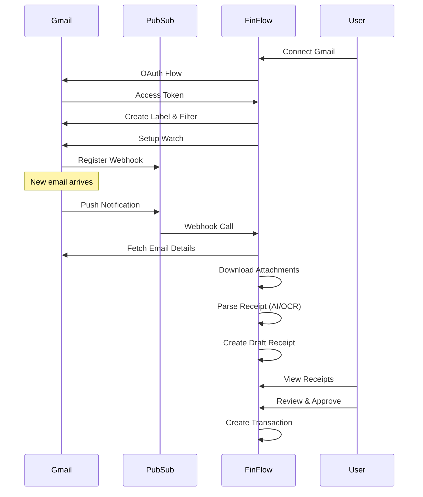

# Gmail Integration Setup Guide

This guide explains how to set up the Gmail integration for FinFlow to automatically import receipts and invoices from Gmail.

## Prerequisites

- A Google Cloud Platform account
- Access to the Gmail account you want to integrate
- FinFlow backend deployed with a public URL (for webhook callbacks)

## Overview

The Gmail integration uses:
- **Gmail API** for reading emails and managing labels
- **Google Cloud Pub/Sub** for real-time notifications (Gmail Watch API)
- **OAuth 2.0** for secure authentication with read-only access

## Step 1: Enable Gmail API

1. Go to [Google Cloud Console](https://console.cloud.google.com/)
2. Select or create a project
3. Navigate to **APIs & Services** → **Library**
4. Search for "Gmail API"
5. Click **Enable**

## Step 2: Create OAuth 2.0 Credentials

1. In Google Cloud Console, go to **APIs & Services** → **Credentials**
2. Click **Create Credentials** → **OAuth client ID**
3. If prompted, configure the OAuth consent screen:
   - Choose **External** (for testing) or **Internal** (for workspace users)
   - Fill in application name: "FinFlow"
   - Add your email as developer contact
   - Add scopes:
     - `https://www.googleapis.com/auth/gmail.readonly`
     - `https://www.googleapis.com/auth/gmail.labels`
     - `https://www.googleapis.com/auth/gmail.settings.basic`
   - Add test users (if External)
4. Create OAuth client ID:
   - Application type: **Web application**
   - Name: "FinFlow Gmail Integration"
   - Authorized redirect URIs:
     - `http://localhost:3001/api/v1/integrations/gmail/callback` (development)
     - `https://your-domain.com/api/v1/integrations/gmail/callback` (production)
5. Save the **Client ID** and **Client Secret**

## Step 3: Enable Cloud Pub/Sub API

1. In Google Cloud Console, navigate to **APIs & Services** → **Library**
2. Search for "Cloud Pub/Sub API"
3. Click **Enable**

## Step 4: Create Pub/Sub Topic

1. Go to **Pub/Sub** → **Topics**
2. Click **Create Topic**
3. Enter topic name: `gmail-watch-notifications`
4. Leave other settings as default
5. Click **Create**

## Step 5: Create Pub/Sub Subscription

1. In the topic details page, click **Create Subscription**
2. Enter subscription name: `gmail-watch-sub`
3. Delivery type: **Push**
4. Endpoint URL: `https://your-domain.com/api/v1/webhook/gmail/pubsub`
   - For development: Use ngrok or similar to expose localhost
   - Example: `https://abc123.ngrok.io/api/v1/webhook/gmail/pubsub`
5. Enable authentication (optional but recommended):
   - Create a service account
   - Generate a key
   - Use the key to sign requests
6. Click **Create**

## Step 6: Grant Gmail Service Account Permissions

1. The Gmail API needs permission to publish to the Pub/Sub topic
2. Run this command (replace with your project ID and topic name):

```bash
gcloud projects add-iam-policy-binding YOUR_PROJECT_ID \
  --member=serviceAccount:gmail-api-push@system.gserviceaccount.com \
  --role=roles/pubsub.publisher
```

Alternatively, in the Google Cloud Console:
1. Go to **Pub/Sub** → **Topics** → Select your topic
2. Click **Permissions**
3. Click **Add Principal**
4. Principal: `gmail-api-push@system.gserviceaccount.com`
5. Role: **Pub/Sub Publisher**
6. Click **Save**

## Step 7: Configure Environment Variables

Add these variables to your backend `.env` file:

```bash
# Gmail OAuth
GMAIL_CLIENT_ID=your-client-id.apps.googleusercontent.com
GMAIL_CLIENT_SECRET=your-client-secret
GMAIL_REDIRECT_URI=https://your-domain.com/api/v1/integrations/gmail/callback

# Google Cloud Pub/Sub
GOOGLE_CLOUD_PROJECT_ID=your-project-id
PUBSUB_TOPIC_NAME=gmail-watch-notifications
PUBSUB_SUBSCRIPTION_NAME=gmail-watch-sub
PUBSUB_WEBHOOK_TOKEN=generate-random-token-here

# Optional: State secret for OAuth flow
GMAIL_STATE_SECRET=change-this-state-secret
```

Generate a random webhook token:
```bash
openssl rand -hex 32
```

## Step 8: Test the Integration

1. Start your backend server
2. Navigate to **Settings** → **Integrations** → **Gmail** in FinFlow
3. Click **Connect Gmail**
4. Authorize the application with your Gmail account
5. FinFlow will automatically:
   - Create a label: "FinFlow/Receipts"
   - Create a filter to catch emails with attachments and receipt keywords
   - Set up Gmail Watch API to receive notifications

## Step 9: Verify the Setup

1. Send a test email to yourself with an attachment
2. Add the "FinFlow/Receipts" label to it (or let the filter catch it)
3. Check the **Receipts** page in FinFlow
4. The receipt should appear within a few seconds

## How It Works



## Troubleshooting

### OAuth Errors

**Error: redirect_uri_mismatch**
- Ensure the redirect URI in Google Cloud matches exactly with your backend URL
- Check for trailing slashes and http vs https

**Error: access_denied**
- User cancelled authorization or didn't grant required permissions
- Ensure all required scopes are configured

### Pub/Sub Not Receiving Notifications

**Check Watch Status:**
```bash
curl -H "Authorization: Bearer YOUR_TOKEN" \
  https://your-api.com/api/v1/integrations/gmail/status
```

**Gmail Watch expires after 7 days:**
- FinFlow automatically renews watches every 6 hours
- Check the `GmailScheduler` logs for renewal errors

**Webhook not called:**
- Verify the Pub/Sub subscription endpoint URL is correct
- Check firewall rules allow incoming requests from Google IPs
- Test the webhook endpoint manually:
  ```bash
  curl -X POST \
    -H "Authorization: Bearer YOUR_WEBHOOK_TOKEN" \
    -H "Content-Type: application/json" \
    -d '{"message":{"data":"eyJlbWFpbEFkZHJlc3MiOiJ0ZXN0QGV4YW1wbGUuY29tIiwiaGlzdG9yeUlkIjoiMTIzNDUifQ==","messageId":"test","publishTime":"2024-01-01T00:00:00Z"},"subscription":"test"}' \
    https://your-api.com/api/v1/webhook/gmail/pubsub
  ```

### Receipts Not Appearing

**Check the filter:**
- Go to Gmail → **Settings** → **Filters and Blocked Addresses**
- Verify the FinFlow filter is active
- Test by manually adding the "FinFlow/Receipts" label to an email

**Check processing jobs:**
```sql
SELECT * FROM receipt_processing_jobs WHERE status = 'failed';
```

**Check backend logs:**
```bash
docker-compose logs -f finflow-backend | grep Gmail
```

## Security Best Practices

1. **Use read-only scopes** - Never request write access to Gmail
2. **Encrypt tokens** - Tokens are encrypted at rest using `INTEGRATIONS_ENCRYPTION_KEY`
3. **Verify webhook signatures** - Pub/Sub messages should be authenticated
4. **Limit OAuth consent screen** - Use Internal if possible
5. **Monitor API usage** - Set up quotas in Google Cloud Console
6. **Regular token rotation** - Tokens are refreshed automatically before expiry

## Rate Limits

Gmail API quotas (as of 2024):
- **250 quota units per user per second**
- **1 billion quota units per day**

Operations:
- `messages.list`: 5 units
- `messages.get`: 5 units
- `messages.attachments.get`: 5 units
- `users.watch`: 100 units

**To stay within limits:**
- Process receipts in batches
- Use history API for incremental sync
- Cache message metadata

## Production Checklist

- [ ] OAuth consent screen verified
- [ ] Production redirect URI configured
- [ ] Pub/Sub topic created in production project
- [ ] Pub/Sub subscription pointing to production URL
- [ ] Service account permissions granted
- [ ] Environment variables set in production
- [ ] SSL certificate valid for webhook endpoint
- [ ] Webhook token configured and kept secret
- [ ] Monitoring and alerting set up for:
  - Watch expiration failures
  - Webhook delivery failures
  - Receipt parsing errors
- [ ] Tested with real Gmail account
- [ ] User documentation updated

## Resources

- [Gmail API Documentation](https://developers.google.com/gmail/api)
- [Gmail Watch API](https://developers.google.com/gmail/api/guides/push)
- [Google Cloud Pub/Sub](https://cloud.google.com/pubsub/docs)
- [OAuth 2.0 for Web Server Applications](https://developers.google.com/identity/protocols/oauth2/web-server)
