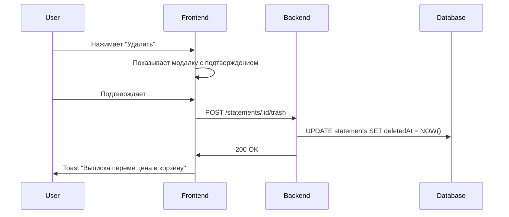

# Корзина для выписок

## Описание

Теперь на странице **Statements** (Выписки) при удалении файл не удаляется навсегда, а перемещается в корзину, как на странице **Storage** (Хранилище).

## Что изменилось

### Backend

1. **Добавлен endpoint для перемещения в корзину:**
   - `POST /statements/:id/trash` - перемещает выписку в корзину (soft delete)
   - Устанавливает `deletedAt = текущая дата`

2. **Изменен существующий DELETE endpoint:**
   - `DELETE /statements/:id` теперь делает soft delete (перемещение в корзину)
   - `DELETE /statements/:id?permanent=true` - окончательное удаление

3. **Обновлен метод restore:**
   - `POST /statements/:id/restore` теперь также восстанавливает из корзины
   - Сбрасывает `deletedAt = null`

4. **Изменен метод findAll:**
   - Теперь фильтрует удаленные файлы: `WHERE deletedAt IS NULL`
   - Файлы в корзине не отображаются в списке выписок

### Frontend

1. **Обновлена страница Statements:**
   - При клике на кнопку "Удалить" файл перемещается в корзину через `POST /statements/:id/trash`
   - Не происходит окончательное удаление

2. **Обновлены тексты локализации:**
   - **Заголовок:** "Переместить выписку в корзину?" вместо "Удалить выписку?"
   - **Сообщение:** "Выписка будет перемещена в корзину. Вы сможете восстановить её позже из раздела Хранилище."
   - **Кнопка:** "Переместить в корзину" вместо "Удалить"
   - **Toast:** "Перемещение в корзину..." и "Выписка перемещена в корзину"

## Как работает

### 1. Удаление выписки



### 2. Просмотр корзины

Удаленные выписки можно найти в разделе **Storage** (Хранилище) → **Корзина**:
- Открыть страницу `/storage`
- Переключиться на вкладку "Корзина"

### 3. Восстановление из корзины

Из страницы **Storage** можно восстановить удаленную выписку:
- Найти файл в корзине
- Нажать кнопку "Восстановить"
- Backend вызывает `POST /statements/:id/restore`
- `deletedAt` сбрасывается в `null`
- Выписка снова появляется в списке на странице Statements

### 4. Окончательное удаление

Окончательное удаление выполняется только из страницы Storage (корзины):
- Backend: `DELETE /statements/:id?permanent=true`
- Удаляются связанные транзакции
- Удаляется файл с диска
- Удаляется запись из базы данных

## Технические детали

### Backend файлы

**`backend/src/modules/statements/statements.controller.ts`:**
```typescript
@Post(":id/trash")
@HttpCode(HttpStatus.OK)
async moveToTrash(@Param("id") id: string, @CurrentUser() user: User) {
  return this.statementsService.moveToTrash(id, user.id);
}

@Post(":id/restore")
async restoreFile(@Param("id") id: string, @CurrentUser() user: User) {
  return this.statementsService.restoreFile(id, user.id);
}

@Delete(":id")
@HttpCode(HttpStatus.NO_CONTENT)
async remove(@Param("id") id: string, @CurrentUser() user: User, @Query("permanent") permanent?: string) {
  const isPermanent = permanent === "true";
  if (isPermanent) {
    await this.statementsService.permanentDelete(id, user.id);
  } else {
    await this.statementsService.moveToTrash(id, user.id);
  }
}
```

**`backend/src/modules/statements/statements.service.ts`:**
```typescript
async moveToTrash(id: string, userId: string): Promise<Statement> {
  const statement = await this.findOne(id, userId);
  await this.ensureCanModify(statement, userId);
  
  statement.deletedAt = new Date();
  await this.statementRepository.save(statement);
  
  return statement;
}

async findAll(userId: string, page = 1, limit = 20, search?: string) {
  const qb = this.statementRepository
    .createQueryBuilder("statement")
    .where("statement.deletedAt IS NULL")  // Фильтруем удаленные
    .orderBy("statement.createdAt", "DESC");
  // ...
}
```

### Frontend файлы

**`frontend/app/statements/page.tsx`:**
```typescript
const handleDelete = async () => {
  if (!statementToDelete) return;
  
  const toastId = toast.loading(t.deleteLoading.value);
  try {
    await apiClient.post(`/statements/${statementToDelete}/trash`);
    await loadStatements({ page, search });
    toast.success(t.deleteSuccess.value, { id: toastId });
  } catch (error) {
    console.error("Failed to move statement to trash:", error);
    toast.error(t.deleteError.value, { id: toastId });
  }
  setStatementToDelete(null);
  setDeleteModalOpen(false);
};
```

**`frontend/app/statements/page.content.ts`:**
```typescript
confirmDelete: {
  title: t({
    ru: "Переместить выписку в корзину?",
    en: "Move statement to trash?",
    kk: "Үзіндіні себетке жылжыту керек пе?",
  }),
  message: t({
    ru: "Выписка будет перемещена в корзину. Вы сможете восстановить её позже из раздела Хранилище.",
    en: "The statement will be moved to trash. You can restore it later from the Storage section.",
    kk: "Үзінді себетке жылжытылады. Оны кейінірек Сақтау бөлімінен қалпына келтіруге болады.",
  }),
  confirm: t({
    ru: "Переместить в корзину",
    en: "Move to trash",
    kk: "Себетке жылжыту",
  }),
}
```

## База данных

Поле `deletedAt` уже существует в entity `Statement`:
```typescript
@Column({ name: "deleted_at", type: "timestamp", nullable: true })
deletedAt: Date | null;
```

Миграция не требуется, поле уже есть в базе.

## Преимущества

✅ **Безопасное удаление** - файлы не теряются навсегда  
✅ **Восстановление** - можно вернуть удаленный файл  
✅ **Единообразие** - такой же подход как в Storage  
✅ **Audit trail** - все действия логируются

## Проверка

1. Откройте страницу **Statements**: `http://localhost:3000/statements`
2. Нажмите кнопку "Удалить" на любой выписке
3. Подтвердите в модальном окне
4. Файл исчезнет из списка
5. Откройте страницу **Storage**: `http://localhost:3000/storage`
6. Переключитесь на вкладку "Корзина"
7. Найдите удаленную выписку
8. Нажмите "Восстановить"
9. Вернитесь на **Statements** - выписка снова в списке!

## Связанные файлы

- `backend/src/modules/statements/statements.controller.ts`
- `backend/src/modules/statements/statements.service.ts`
- `frontend/app/statements/page.tsx`
- `frontend/app/statements/page.content.ts`
- `backend/src/entities/statement.entity.ts`

---

**Статус:** ✅ Реализовано и развернуто
